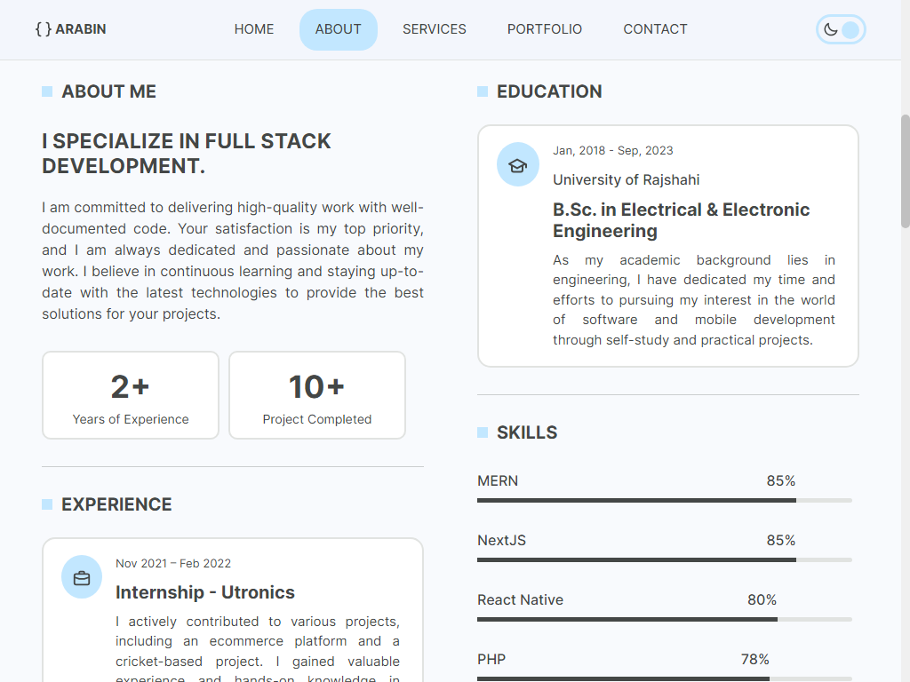

# My Portfolio

Welcome to my personal portfolio repository! This project showcases my skills, services, education, experience, and more.

## Table of Contents

- [Description](#description)
- [Features](#features)
- [Installation](#installation)
- [Usage](#usage)
- [Dependencies](#dependencies)
- [Contact](#contact)
- [License](#license)

## Description

This project is developed using Next.js, a React framework for building modern web applications. It provides an interactive and responsive portfolio website to showcase my skills, services, education, experience, and contact form.

## Features

- Explore the various services I provide
- Learn about my educational background
- Discover my professional experience
- View my skills and expertise
- Contact form to get in touch with me

## Installation

To run this project locally, follow these steps:

1. Clone the repository: `git clone https://github.com/Arabin1/my-portfolio.git`
2. Navigate to the project directory: `cd my-portfolio`
3. Install the dependencies: `npm install`

## Usage

To start the development server, run: `npm run dev`

To build the project for production, run: `npm run build`

To start the production server, run: `npm run start`

## Dependencies

This project utilizes the following dependencies:

- [@iconscout/react-unicons](https://www.npmjs.com/package/@iconscout/react-unicons)
- [@sendgrid/mail](https://www.npmjs.com/package/@sendgrid/mail)
- [Bootstrap](https://getbootstrap.com)
- [Firebase](https://firebase.google.com)
- [Framer Motion](https://www.framer.com/api/motion)
- [React Bootstrap](https://react-bootstrap.github.io)
- [React Scroll](https://www.npmjs.com/package/react-scroll)
- [React Toastify](https://www.npmjs.com/package/react-toastify)

## Contact

For any inquiries or collaboration opportunities, feel free to reach out to me [Md. Asaduzzaman (Arabin)](mailto:aznarabin@gmail.com).

## License

This project is licensed under the [MIT License](LICENSE).
